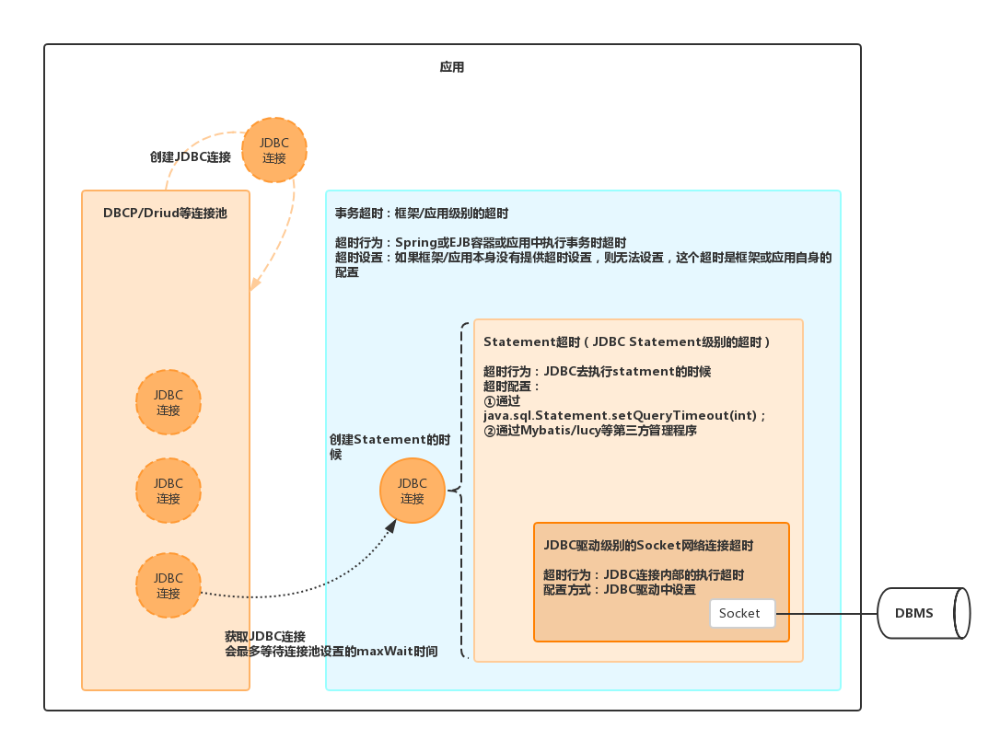

# 数据库超时

## 数据库服务端超时设置


## 数据库客户端超时设置

数据库客户端的超时主要可以分为JDBC超时/连接池超时/Statement超时/事务超时等。这些超时配置的关系和层级如下图所示：



上图中，更上层的超时依赖于下层的超时，只有当较低层的超时机制正常工作，上层的超时才会正常。如果 JDBC 驱动程序的socket超时工作不正常，那么更上层的超时比如 Statement 超时和事务超时都不会正常工作。

### 1、JDBC超时设置

JDBC即数据库的驱动程序，是Java应用中用来连接关系型数据库的标准API。比如我们使用MySQL数据库时，一般会在项目中添加mysql-connector-java.jar，这个库就是JDBC的实现。

JDBC部分主要处理网络连接超时，来处理网络故障 。因为JDBC是属于低级别的库， 高级别的timeout依赖于低级别的timeout，只有当低级别的timeout无误时，高级别的timeout才能确保正常。因此，假如socket timeout出现问题时，高级别的statement timeout和transaction timeout都将失效。 

举个例子，假如JDBC没有设置超时时间，执行某一Statement时设置了超时5s，假如此时发生了网络故障，那么JDBC因为网络故障就会在此挂住，而上层Statement无法感知这种挂起，也会跟着等待，直到JDBC连接成功建立，才开始真正执行该Statement。即Statement时设置的超时5s无效。

### 2、连接池超时设置

数据库连接池，如`DBCP`或最常用的`Driud`，负责的是数据库连接的创建和管理。以`Driud`为例（`DruidDataSource`大部分属性都是参考`DBCP`的），连接池的超时设置有以下几项，主要是**`maxWait`**和**`validationQueryTimeout`**。

* **`maxWait`**：从连接池中获取连接时最大等待时间，单位毫秒。连接池中的连接可能是空闲或正在工作，该参数是指假如连接池中所有连接都在工作，没有空闲的连接可以用，将会等待多久（才有空闲的连接可用）。
* **`validationQueryTimeout`**：单位：秒，检测连接是否有效的超时时间。底层调用`JDBC Statement`对象的`void setQueryTimeout(int seconds)`方法，其实相当于Statement级别的超时设置。 
* `timeBetweenEvictionRunsMillis`：有两个含义： 1\) Destroy线程会检测连接的间隔时间，如果连接空闲时间大于等于`minEvictableIdleTimeMillis`则关闭物理连接。 2\) `testWhileIdle`的判断依据，`testWhileIdle`是指在申请连接的时候对连接的有效性进行检测，如果空闲时间大于`timeBetweenEvictionRunsMillis`，执行validationQuery检测连接是否有效。
* `minEvictableIdleTimeMillis`：连接保持空闲而不被驱逐的最小时间

  
当在应用中调用`DBCP/Driud`的`getConnection()`方法时，你可以设置获取数据库连接的超时时间，但是这和JDBC的socket超时毫不相关。 

### 3、Statement超时设置

Statement 超时是用来限制 Statement 的执行时间的，它的具体值是通过下面的JDBC API来设置的。JDBC 驱动程序基于这个值进行 Statement 执行时的超时处理。

```text
java.sql.Statement.setQueryTimeout(int timeout) 
```

但是，一般在开发中，我们一般会使用ORM框架开发，不会出现上面的代码。所以，这个配置更多是通过框架来进行设置（然后再传递给底层的JDBC使用）。

以`MyBatis`为例：单位：秒，默认值都是unset，即会使用具体驱动的设置。

```markup
<!-- 在Configuration中设置全局的Statement超时：默认值为unset，即使用具体驱动的设置-->
<configuration>
    ... ...
    <settings>
        ... ...
        <setting name="defaultStatementTimeout" value="25"/>
        ... ...
    </settings>
    
    <typeAliases> ... ...   </typeAliases>    
    <typeHandlers> ... ...  </typeHandlers>
    <plugins>... ... </plugins>
</configuration>

<!-- 在具体的语句中置Statement超时：默认值为unset，即使用具体驱动的设置 -->
<insert id="add" timeout="5">
   ... ... 
</insert>
```

如果使用 Lucy 1.5或1.6版，可以通过设置 `queryTimeout` 属性在数据源层面设置Statement 超时。

Statement 超时的具体数值需要根据每个应用自身的情况而定，并没有推荐的配置。

### 4、Transition超时设置

事务超时是在框架（Spring或EJB容器）或应用程序层面上才有效的超时。主要用来限制执行一个事务内所有 Statement 执行的总时长。因此，事务超时可以理解为：

```text
事务超时 = Statement超时时间 * 执行的 Statement 的数量 + 其他垃圾回收等时间
```

比如，假设执行一次Statement 需要0.1秒，那执行几次 Statement并不是什么问题，但如果是执行十万次则需要一万秒（大约7个小时），这就可以用上事务超时了。

开发中最常用的就是Spring 框架，所以事务超时的配置也由 Spring 来管理。

XML文件配置方式：单位：秒，默认-1，即使用底层事务控制系统的配置。

```markup
<tx:attributes>
        <tx:method name="…" timeout="3"/>
</tx:attributes>

```

Transactional 注解方式：单位：秒，默认-1，即使用底层事务控制系统的配置。

```java
@Transactional(timeout=10)
public void add(){
    ... ...
}
```

Spring 提供的事务超时的配置非常简单，它会记录每个事务的开始时间和消耗时间，当特定的事件发生时会对已消耗掉的时间做校验，如果超出了配置将抛出异常。

> 在Spring 中，数据库连接会被保存到线程本地变量ThreadLocal中（这被称作事务同步Transaction Synchronization）。当数据库连接被保存到 ThreadLocal 时，同时会记录事务的开始时间和超时时间。所以通过数据库连接的代理创建的 Statement 在执行时就会校验这个时间。


## 

  
  
作者：预流  
链接：https://www.jianshu.com/p/2deaf51bf715  
來源：简书  
简书著作权归作者所有，任何形式的转载都请联系作者获得授权并注明出处。


> 即使配置了 Statement 超时，应用程序还是不能从故障中恢复，因为 Statement 超时在网络故障时不起作用。

**Statement 超时在网络故障时不起作用**。它只能做到：限制一次Statement 执行的时间，处理超时以防网络故障必须由 JDBC 驱动来做。

JDBC 驱动的 socket 超时还会受操作系统的 socket 超时配置的影响。这解释了为什么案例中的 JDBC 连接在网络故障后阻塞了30分钟才恢复，即使没配置 JDBC 驱动的 socket 超时。

DBCP 连接池位于图2的左边。你会发现各种层面的超时与 DBCP 是分开的。DBCP 负责数据库连接（即本文中说到的**Connection**）的创建和管理，并不涉及超时的处理。当在 DBCP 中创建了一个数据库连接或发送了一条查询校验的 sql 语句用于检查连接有效性时，socket 超时会影响这些过程的处理，但并不直接影响应用程序。

然而在应用程序中调用 DBCP 的 getConnection\(\) 方法时，你能指定应用程序获取数据库连接的超时时间，但这和 JDBC 的连接超时无关。


## Druid超时设置

DruidDataSource大部分属性都是参考DBCP的，超时相关配置加了粗体显示。

| 配置 | 缺省值 | 说明 |
| --- | --- | --- | --- | --- | --- | --- | --- | --- | --- | --- | --- |
| maxActive | 8 | 最大连接池数量 |
| minIdle |  | 最小连接池数量 |
| **maxWait** |  | **获取连接时最大等待时间**，单位毫秒。配置了maxWait之后，缺省启用公平锁，并发效率会有所下降，如果需要可以通过配置useUnfairLock属性为true使用非公平锁。 |
| validationQuery |  | 用来检测连接是否有效的sql，要求是一个查询语句，常用select 'x'。如果validationQuery为null，testOnBorrow、testOnReturn、testWhileIdle都不会起作用。 |
| **validationQueryTimeout** |  | 单位：秒，**检测连接是否有效的超时时间**。底层调用jdbc Statement对象的void setQueryTimeout\(int seconds\)方法 |
| testOnBorrow | true | 申请连接时执行validationQuery检测连接是否有效，做了这个配置会降低性能。 |
| testOnReturn | false | 归还连接时执行validationQuery检测连接是否有效，做了这个配置会降低性能。 |
| testWhileIdle | false | 建议配置为true，不影响性能，并且保证安全性。申请连接的时候检测，如果空闲时间大于`timeBetweenEvictionRunsMillis`，执行validationQuery检测连接是否有效。 |
| keepAlive | false （1.0.28） | 连接池中的`minIdle`数量以内的连接，空闲时间超过`minEvictableIdleTimeMillis`，则会执行keepAlive操作。 |
| **timeBetweenEvictionRunsMillis** | 1分钟（1.0.14） | 有两个含义： 1\) Destroy线程会检测连接的间隔时间，如果连接空闲时间大于等于`minEvictableIdleTimeMillis`则关闭物理连接。 2\) testWhileIdle的判断依据，详细看testWhileIdle属性的说明 |
| **minEvictableIdleTimeMillis** |  | 连接保持空闲而不被驱逐的最小时间 |


参考

[如何配置MySQL数据库超时设置](https://blog.csdn.net/qq_34531925/article/details/78812841)

[MySQL的timeout那点事](http://www.penglixun.com/tech/database/mysql_timeout.html)

[深入理解JDBC的超时设置](http://www.importnew.com/2466.html)

[Understanding JDBC Internals & Timeout Configuration](https://www.cubrid.org/blog/understanding-jdbc-internals-and-timeout-configuration)

[MyBatis官方文档](http://www.mybatis.org/mybatis-3/zh/configuration.html#settings)

[Apache Commons DBCP](http://commons.apache.org/dbcp/)

[DruidDataSource配置属性列表](https://github.com/alibaba/druid/wiki/DruidDataSource%E9%85%8D%E7%BD%AE%E5%B1%9E%E6%80%A7%E5%88%97%E8%A1%A8)

