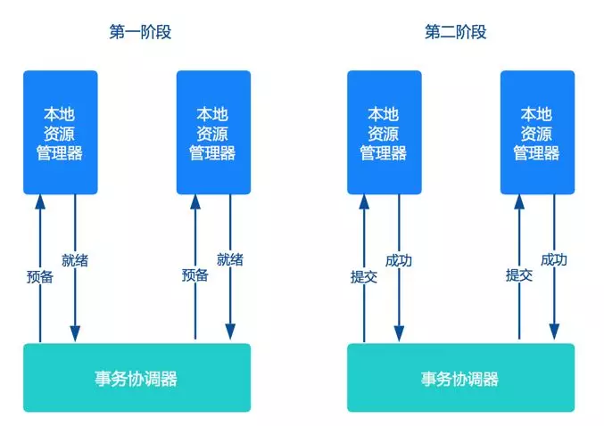
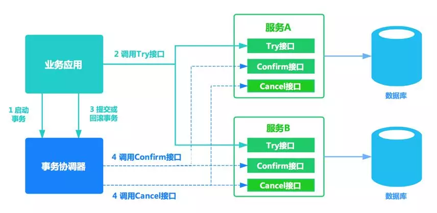
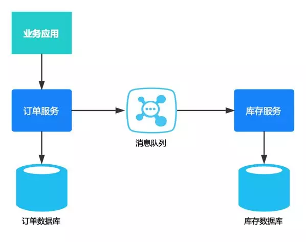

# 分布式事务

## 分布式事务解决方案

一个简单操作，在服务端非常可能是由多个服务和数据库实例协同完成的。

在互联网金融等一致性要求较高的场景下，多个独立操作之间的一致性问题显得格外棘手。

基于水平扩容能力和成本考虑，传统的强一致的解决方案（e.g.单机事务）纷纷被抛弃。其理论依据就是[CAP原理](http://link.zhihu.com/?target=https%3A//en.wikipedia.org/wiki/CAP_theorem)。

我们往往为了可用性和分区容错性，忍痛放弃强一致支持，转而追求最终一致性。大部分业务场景下，我们是可以接受短暂的不一致的。

> 在分布式系统中，同时满足“CAP定律”中的“一致性”、“可用性”和“分区容错性”三者是不可能的，这比现实中找对象需同时满足“高、富、帅”或“白、富、美”更加困难。在互联网领域的绝大多数的场景，都需要牺牲强一致性来换取系统的高可用性，系统往往只需要保证“最终一致性”，只要这个最终时间是在用户可以接受的范围内即可。

分布式事务的解决方案主要有以下几种。

### 1、**基于XA协议的两阶段提交方案**

交易中间件与数据库通过 XA 接口规范，使用两阶段提交来完成一个全局事务， XA 规范的基础是两阶段提交协议。

* 第一阶段是表决阶段，所有参与者都将本事务能否成功的信息反馈发给协调者；
* 第二阶段是执行阶段，协调者根据所有参与者的反馈，通知所有参与者，步调一致地在所有分支上提交或者回滚。



两阶段提交这种解决方案属于牺牲了一部分可用性来换取的一致性。

两阶段提交方案应用非常广泛，几乎所有商业OLTP数据库都支持XA协议。但是两阶段提交方案锁定资源时间长，对性能影响很大，基本不适合解决微服务事务问题。

SpringBoot中使用JTA处理分布式事务：

Spring Boot通过[Atomkos](http://www.atomikos.com/)或[Bitronix](https://github.com/bitronix/btm)的内嵌事务管理器支持跨多个XA资源的分布式JTA事务，当部署到恰当的J2EE应用服务器时也会支持JTA事务。当发现JTA环境时，Spring Boot将使用Spring的`JtaTransactionManager`来管理事务。自动配置的JMS，DataSource和JPA beans将被升级以支持XA事务。可以使用标准的Spring idioms，比如`@Transactional`，来参与到一个分布式事务中。如果处于JTA环境，但仍想使用本地事务，你可以将`spring.jta.enabled`属性设置为`false`来禁用JTA自动配置功能。

## 2、补偿事务（TCC）

TCC（try-commit-cancel） 其实就是采用的补偿机制，其核心思想是：针对每个操作，都要注册一个与其对应的确认和补偿（撤销）操作。



它分为三个阶段：

* Try 阶段：主要是对业务系统做检测及资源预留
* Confirm 阶段：主要是对业务系统做确认提交，Try阶段执行成功并开始执行 Confirm阶段时，默认 Confirm阶段是不会出错的。即：只要Try成功，Confirm一定成功。
* Cancel 阶段主要是在业务执行错误，需要回滚的状态下执行的业务取消，预留资源释放。

> 举个例子，假入 Bob 要向 Smith 转账，思路大概是：  
> 我们有一个本地方法，里面依次调用  
> 1、首先在 Try 阶段，要先调用远程接口把 Smith 和 Bob 的钱给冻结起来。  
> 2、在 Confirm 阶段，执行远程调用的转账的操作，转账成功进行解冻。  
> 3、如果第2步执行成功，那么转账成功；如果第二步执行失败，则调用远程冻结接口对应的解冻方法 \(Cancel\)。
>
> 优点： 跟2PC比起来，实现以及流程相对简单了一些，但数据的一致性比2PC也要差一些
>
> 缺点： 缺点还是比较明显的，在2,3步中都有可能失败。TCC属于应用层的一种补偿方式，所以需要程序员在实现的时候多写很多补偿的代码，在一些场景中，一些业务流程可能用TCC不太好定义及处理。

事务开始时，业务应用会向事务协调器注册启动事务。之后业务应用会调用所有服务的try接口，完成一阶段准备。之后事务协调器会根据try接口返回情况，决定调用confirm接口或者cancel接口。如果接口调用失败，会进行重试。

TCC方案让应用自己定义数据库操作的粒度，使得降低锁冲突、提高吞吐量成为可能。 当然TCC方案也有不足之处，集中表现在以下两个方面：

* 对应用的侵入性强。业务逻辑的每个分支都需要实现try、confirm、cancel三个操作，应用侵入性较强，改造成本高。
* 实现难度较大。需要按照网络状态、系统故障等不同的失败原因实现不同的回滚策略。为了满足一致性的要求，confirm和cancel接口必须实现幂等。

上述原因导致TCC方案大多被研发实力较强、有迫切需求的大公司所采用。微服务倡导服务的轻量化、易部署，而TCC方案中很多事务的处理逻辑需要应用自己编码实现，复杂且开发量大。

## 3、基于消息的最终一致性方案

消息一致性方案是通过消息中间件保证上、下游应用数据操作的一致性。

基本思路：

①将本地操作和发送消息放在一个事务中，保证本地操作和消息发送要么两者都成功或者都失败。

②下游应用向消息系统订阅该消息，收到消息后执行相应操作。



消息方案从本质上讲是将分布式事务转换为两个本地事务，然后依靠下游业务的重试机制达到最终一致性。基于消息的最终一致性方案对应用侵入性也很高，应用需要进行大量业务改造，成本较高。

这种方式又可以根据消息中间件支持/不支持事务消息两种。

**假如消息中间件不支持事务消息**

消息生产者：

```text
public void transfer(){
    try{
        //①操作数据库
        boolean result = dao.update(model);// 数据库失败的话，会抛出异常
        //②如果第①步成功，则发消息
        if(result){
            mq.send(msg);//消息发送失败的话，会抛出异常
        } 
    }catch(Exception e){
        //③数据库回滚
        rollback();
    }
}
```

根据上述代码及注释，我们来分析下可能的情况：

1. 操作数据库成功，向MQ中投递消息也成功，皆大欢喜
2. 操作数据库失败，不会向MQ中投递消息了
3. 操作数据库成功，但是向MQ中投递消息时失败，向外抛出了异常，刚刚执行的更新数据库的操作将被回滚

从上面分析的几种情况来看，生产者貌似问题都不大的。

那么我们来分析下消费者端面临的问题：

1. 消息出列后，消费者对应的业务操作要执行成功。如果业务执行失败，消息不能失效或者丢失。需要保证消息与业务操作一致
2. 尽量避免消息重复消费。如果重复消费，也不能因此影响业务结果

主流的MQ产品都具有持久化消息的功能。如果消费者宕机或者消费失败，都可以执行重试机制的（有些MQ可以自定义重试次数）。

如何避免消息被重复消费造成的问题？

1. 保证消费者调用业务的服务接口的幂等性
2. 通过消费日志或者类似状态表来记录消费状态，便于判断（建议在业务上自行实现，而不依赖MQ产品提供该特性）

总结：这种方式比较常见，如果MQ自身和业务都具有高可用性，理论上是可以满足大部分的业务场景的。不过在没有充分测试的情况下，不建议在交易业务中直接使用。

**假如消息中间件支持事务消息：（以**RocketMQ为例**）**  
RocketMQ第一阶段发送Prepared消息时，会拿到消息的地址，第二阶段执行本地事物，第三阶段通过第一阶段拿到的地址去访问消息，并修改状态。细心的读者可能又发现问题了，如果确认消息发送失败了怎么办？RocketMQ会定期扫描消息集群中的事物消息，这时候发现了Prepared消息，它会向消息发送者确认，Bob的钱到底是减了还是没减呢？如果减了是回滚还是继续发送确认消息呢？RocketMQ会根据发送端设置的策略来决定是回滚还是继续发送确认消息。这样就保证了消息发送与本地事务同时成功或同时失败。


各大知名的电商平台和互联网公司，几乎都是采用类似的设计思路来实现“最终一致性”的。这种方式适合的业务场景广泛，而且比较可靠。

内容来源：

[聊聊分布式事务，再说说解决方案](https://www.cnblogs.com/savorboard/p/distributed-system-transaction-consistency.html)

[Spring Boot学习笔记\(二三\) - 使用JTA处理分布式事务](http://www.hifreud.com/2017/07/12/spring-boot-23-jta-handle-distribute-transaction/)

[分布式系统事务一致性解决方案](http://www.infoq.com/cn/articles/solution-of-distributed-system-transaction-consistency)

[GTS来了！阿里微服务架构下的分布式事务解决方案](https://mp.weixin.qq.com/s/bUtu2nTs0bybnTvk-iLt6Q)

[RocketMQ实战（三）：分布式事务](https://www.jianshu.com/p/53324ea2df92)

[Spring Cloud分布式事务终极解决方案探讨](https://segmentfault.com/a/1190000012762869)

